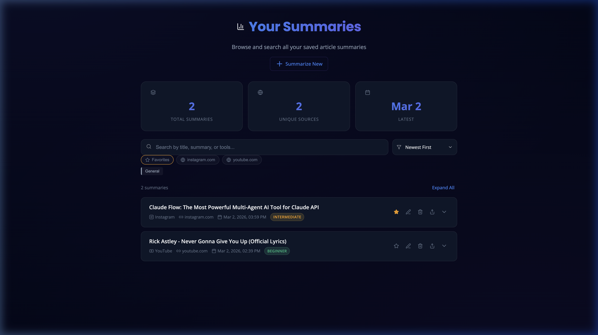

# 🧠 Insta Reel, YouTube Shorts & Blog Summarizer

> Paste any URL — Blog, YouTube video, or Instagram Reel — and get a structured AI summary in seconds. All summaries are saved locally in a personal knowledge base you can search, filter, edit, and export.

**Built with:** Python · FastAPI · Google Gemini API · SQLite · Vanilla JS

---

## 📸 Screenshots

| Homepage | Dashboard |
|----------|-----------|
|  |  |

---

## ✨ Features

### 🚀 Universal Summarization
- **Blogs & Articles** — Scrapes any webpage using BeautifulSoup and summarizes the content.
- **YouTube Videos** — Fetches transcripts via the YouTube Transcript API. If no transcript is available, it falls back to downloading the audio with `yt-dlp` and transcribing it locally with **OpenAI Whisper**.
- **Instagram Reels** — Downloads reel audio via `yt-dlp`, transcribes with Whisper, and summarizes.

### ⏱️ Real-Time Progress
- A live SSE (Server-Sent Events) stepper shows each stage: URL detection → scraping/downloading → transcription → AI summarization → saved.

### 🗂️ Smart Knowledge Base
- **AI Categorization** — Each summary is automatically tagged into a domain (AI, Web Dev, ML, etc.).
- **Difficulty Scoring** — Summaries are rated as Beginner, Intermediate, or Advanced.
- **Smart Search** — Search across titles, summaries, key points, and tools mentioned.
- **Sorting** — Sort by date, difficulty, title, or category.
- **Domain Filters** — Filter by source (youtube.com, instagram.com, etc.).

### ⭐ Personalization
- **Favorites** — Star important summaries and filter to show favorites only.
- **Manual Editing** — Edit any AI-generated summary to add your own notes or corrections. Edited summaries are marked with an "Edited" badge.

### 📤 Export
- **Copy to Clipboard** — One click copies a neatly formatted Markdown version.
- **Download as `.md`** — Download any summary as a Markdown file for use in Notion, Obsidian, etc.

### 🤖 Telegram Bot
- **Mobile Ingestion** — Share any URL from your phone to a Telegram Bot and it auto-summarizes.
- **Commands** — `/start` (welcome), `/help` (usage), or just paste a URL.
- **Same Knowledge Base** — Summaries land on your dashboard alongside web-submitted ones.

---

## 🚀 Getting Started

### Prerequisites

| Requirement     | Details                                                                                                   |
|-----------------|-----------------------------------------------------------------------------------------------------------|
| **Python**      | 3.9 or higher                                                                                             |
| **ffmpeg**      | Required for audio processing. Install via `brew install ffmpeg` (macOS) or `sudo apt install ffmpeg` (Linux). |
| **Gemini API Key** | Free from [Google AI Studio](https://aistudio.google.com/apikey)                                       |

### 1. Clone the Repository

```bash
git clone https://github.com/hemish22/insta-reel-shorts-blogs-summariser-.git
cd insta-reel-shorts-blogs-summariser-
```

### 2. Install Python Dependencies

```bash
cd blog_summarizer/backend
pip install -r requirements.txt
```

> **Note:** The `openai-whisper` package will download the Whisper model (~140 MB) on first use. This is automatic.

### 3. Configure Your API Key

Create a `.env` file inside the `blog_summarizer/backend/` directory:

```bash
cp .env.example .env
```

Then open `blog_summarizer/backend/.env` and replace the placeholder with your actual key:

```env
GEMINI_API_KEY=your_actual_gemini_api_key_here
```

> ⚠️ **Important:** The `.env` file is listed in `.gitignore` and will **never** be pushed to GitHub. Your API key stays on your machine only.

### 4. Run the Application

```bash
# Make sure you are inside blog_summarizer/backend/
uvicorn main:app --reload
```

### 5. Open in Your Browser

| Page       | URL                                      |
|------------|------------------------------------------|
| Homepage   | [http://localhost:8000](http://localhost:8000)         |
| Dashboard  | [http://localhost:8000/dashboard](http://localhost:8000/dashboard) |

### 6. (Optional) Connect Telegram Bot

This lets you share URLs directly from your phone.

**Step A — Create a Telegram Bot:**
1. Open Telegram and search for **@BotFather**
2. Send `/newbot` and follow the prompts
3. Copy the **Bot Token** you receive (looks like `123456:ABC-XYZ...`)

**Step B — Add token to `.env`:**
```env
TELEGRAM_BOT_TOKEN=your_telegram_bot_token_here
```

**Step C — Expose your server (for local dev):**
```bash
# Install ngrok (one-time)
brew install ngrok   # macOS
# or: snap install ngrok   # Linux

# Start tunnel
ngrok http 8000
```

**Step D — Register webhook:**

Open this URL in your browser (replace with your ngrok URL):
```
http://localhost:8000/telegram-setup?webhook_url=https://xxxx.ngrok-free.app
```

**That's it!** Now send any URL to your bot on Telegram → it summarizes and saves to your dashboard.

> 💡 **For production:** Deploy to Render/Railway and use your public domain as the webhook URL instead of ngrok.

---

## 📁 Project Structure

```
insta-reel-shorts-blogs-summariser-/
├── blog_summarizer/
│   ├── backend/
│   │   ├── main.py                 # FastAPI app, routes, SSE streaming
│   │   ├── scraper.py              # Blog/article scraping (BeautifulSoup)
│   │   ├── gemini_service.py       # Google Gemini API integration
│   │   ├── youtube_service.py      # YouTube transcript fetching + Whisper fallback
│   │   ├── instagram_service.py    # Instagram Reel detection + audio download
│   │   ├── audio_service.py        # yt-dlp audio downloading
│   │   ├── whisper_service.py      # OpenAI Whisper transcription
│   │   ├── transcript_cleaner.py   # Filler word removal, text cleanup
│   │   ├── database.py             # SQLite schema, migrations, CRUD
│   │   ├── models.py               # Pydantic request/response models
│   │   ├── telegram_service.py     # Telegram Bot API helpers
│   │   ├── requirements.txt        # Python dependencies
│   │   ├── .env.example            # Template for API key configuration
│   │   └── .env                    # Your actual API key (git-ignored)
│   └── frontend/
│       ├── index.html              # Homepage — URL input + progress stepper
│       ├── dashboard.html          # Dashboard — Knowledge base UI
│       ├── styles.css              # Full design system (dark mode)
│       └── script.js               # All frontend logic (filters, favorites, export)
├── docs/
│   └── screenshots/                # README screenshots
├── .gitignore                      # Prevents secrets, databases, caches from being pushed
└── README.md                       # This file
```

---

## 🔌 API Endpoints

| Method   | Endpoint                          | Description                           |
|----------|-----------------------------------|---------------------------------------|
| `GET`    | `/`                               | Serves the homepage                   |
| `GET`    | `/dashboard`                      | Serves the dashboard                  |
| `POST`   | `/summarize-stream`              | Summarize a URL with real-time SSE progress |
| `POST`   | `/summarize`                     | Summarize a URL (legacy, non-streaming) |
| `GET`    | `/summaries`                      | Get all saved summaries               |
| `DELETE` | `/summaries/{id}`                 | Delete a summary                      |
| `POST`   | `/summaries/{id}/favorite`       | Toggle favorite status                |
| `PUT`    | `/summaries/{id}/edit`           | Update summary text (manual edit)     |
| `POST`   | `/telegram-webhook`              | Telegram Bot webhook (auto-called by Telegram) |
| `GET`    | `/telegram-setup`                | Register webhook URL with Telegram    |

### Example: Summarize a URL

```bash
curl -X POST http://localhost:8000/summarize \
  -H "Content-Type: application/json" \
  -d '{"url": "https://example.com/some-article"}'
```

**Response:**
```json
{
  "title": "Article Title",
  "domain": "example.com",
  "difficulty": "Intermediate",
  "category": "Web Dev",
  "summary": "A concise summary of the article...",
  "key_points": ["Key point 1", "Key point 2"],
  "takeaway": "The main actionable insight.",
  "original_url": "https://example.com/some-article"
}
```

---

## ⚙️ Configuration Reference

All configuration is done through the `.env` file in `blog_summarizer/backend/`:

| Variable          | Required | Description                                              |
|-------------------|----------|----------------------------------------------------------|
| `GEMINI_API_KEY`  | ✅ Yes    | Your Google Gemini API key from [AI Studio](https://aistudio.google.com/apikey) |
| `TELEGRAM_BOT_TOKEN` | ❌ Optional | Your Telegram Bot token from [@BotFather](https://t.me/BotFather). Only needed for Telegram integration. |

> **SQLite** is used for storage (zero config). Whisper models download automatically on first use.

---

## 🛡️ Security Notes

- **`.env` is git-ignored** — Your API key will never be committed or pushed.
- **`.env.example`** is provided as a safe template with placeholder values.
- **Database files (`*.db`)** are git-ignored — your personal data stays local.
- The application runs entirely on `localhost` — no external services receive your data except the Gemini API for summarization.

---

## 🐛 Troubleshooting

| Issue | Solution |
|-------|---------|
| `ModuleNotFoundError` | Run `pip install -r requirements.txt` again |
| `ffmpeg not found` | Install ffmpeg: `brew install ffmpeg` (macOS) or `sudo apt install ffmpeg` (Linux) |
| `GEMINI_API_KEY not set` | Create `.env` file with your key (see step 3 above) |
| Port 8000 already in use | Kill existing process: `lsof -ti:8000 \| xargs kill -9` |
| Whisper model download slow | First run downloads ~140 MB model. This is a one-time download. |
| Instagram/YouTube download fails | Ensure `yt-dlp` is up to date: `pip install --upgrade yt-dlp` |

---

## 📝 License

MIT License — Free for personal and commercial use.

---

<p align="center">
  Built with ❤️ by <a href="https://github.com/hemish22">hemish22</a>
</p>
